The table of SDLC tasks defines the structured lifecycle for developing, implementing, and validating an automation framework or software system. It organizes tasks by **stage**, ensuring traceability from requirements through deployment and validation.

| ID       | SDLC Task                                                                                                                                | Stage        | Status |
| -------- | ---------------------------------------------------------------------------------------------------------------------------------------- | ------------ | ------ |
| RS-TD001 | Collect requirements                                                                                                                     | Requirements | ✅      |
| RS-TD002 | Identify risks                                                                                                                           | Requirements | ✅      |
| RS-TD003 | Map risks to tests                                                                                                                       | Requirements | ✅      |
| DS-TD001 | Define main test paths                                                                                                                   | Design       | ✅      |
| DS-TD002 | Extract unit tests:   ✅ 1 Generate feature descriptions   ✅  2 Add mocked services calls   ? 3 Add mocked services to the world | Design       |        |
| DS-TD003 | Extract integration tests                                                                                                                | Design       |        |
| DS-TD004 | Extract E2E tests                                                                                                                        | Design       |        |
| DV-TD001 | Implement unit code                                                                                                                      | Development  |        |
| DV-TD002 | Implement test tagging & retry                                                                                                           | Development  |        |
| DV-TD003 | Implement system & parallel execution                                                                                                    | Development  |        |
| DP-TD001 | Push candidate code                                                                                                                      | Deployment   |        |
| VS-TD001 | Setup ELK                                                                                                                                | Validation   |        |
| VS-TD002 | Provide Test Artefacts                                                                                                                   | Validation   |        |
| VS-TD003 | Setup reporter & Allure                                                                                                                  | Validation   |        |
The workflow visualizes task dependencies and execution sequence across SDLC stages:

```mermaid

stateDiagram-v2

  

state ✅⛳️requirements_stage {

✅requirements_determined --> ✅⛳️requirements_stage_started: ⬇️require

✅⛳️requirements_stage_started --> ✅requirements_determined: ⚒️todo_collectRequirements🟢

✅test_strategy_defined --> ✅risks_identified: ⬇️require

✅risks_identified --> ✅test_strategy_defined: ⚒️todo_mapRisksToTests🟢

✅risks_identified --> ✅requirements_determined: ⬇️require

✅requirements_determined --> ✅risks_identified: ⚒️todo_identifyRisks🟢

✅🇫🇮requirements_stage_done --> ✅test_strategy_defined: ⬇️require

✅test_strategy_defined --> ✅🇫🇮requirements_stage_done: ⏩thenMustBe

}

  

design_stage --> ✅⛳️requirements_stage: require

state design_stage {

  

🇫🇮design_stage_done --> validations_determined: ⬇️require

validations_determined --> 🇫🇮design_stage_done: ⏩thenMustBe

  

🇫🇮design_stage_done --> architecture_defined: ⬇️require

architecture_defined --> 🇫🇮design_stage_done: ⏩thenMustBe

  

validations_determined --> unit_test_extracted: ⬇️require

unit_test_extracted --> validations_determined: ⏩thenMustBe

  

validations_determined --> integration_test_extracted: ⬇️require

integration_test_extracted --> validations_determined: ⏩thenMustBe

  

validations_determined --> e2e_test_extracted: ⬇️require

e2e_test_extracted --> validations_determined: ⏩thenMustBe

  

unit_test_extracted --> ✅parent_tests_table_elicited: ⬇️require

✅parent_tests_table_elicited --> unit_test_extracted: ⚒️todo_extractUnitTests

  

integration_test_extracted --> ✅parent_tests_table_elicited: ⬇️require

✅parent_tests_table_elicited --> integration_test_extracted: ⚒️todo_extractIntegrationTests

  

e2e_test_extracted --> ✅parent_tests_table_elicited: ⬇️require

✅parent_tests_table_elicited --> e2e_test_extracted: ⚒️todo_extractE2ETests

  

✅test_seams_defined --> ✅parent_tests_table_elicited: ⬇️require

✅parent_tests_table_elicited --> ✅test_seams_defined: ⏩thenMustBe🟢

  

api_contracts_defined --> ✅test_seams_defined: ⬇️require

✅test_seams_defined --> api_contracts_defined: ⏩thenMustBe

  

architecture_defined --> api_contracts_defined: ⬇️require

api_contracts_defined --> architecture_defined: ⏩thenMustBe

  

✅parent_tests_table_elicited --> ✅⛳️design_stage_started: ⬇️require

✅⛳️design_stage_started --> ✅parent_tests_table_elicited: ⚒️todo_defineMainPaths🟢

}

  

development_stage --> design_stage: require

state development_stage{

  

⛳️development_stage_started --> unit_code_implemented: ⚒️todo_implementUnitCode

unit_code_implemented --> ⛳️development_stage_started: ⬇️require

  

unit_tests_pass --> unit_code_implemented: ⬇️require

unit_code_implemented --> unit_tests_pass: ⏩thenMustBe

integration_tests_pass --> unit_tests_pass: ⬇️require

unit_tests_pass --> integration_tests_pass: ⚒️todo_implementIntegrations

e2e_tests_pass --> integration_tests_pass: ⬇️require

integration_tests_pass --> e2e_tests_pass: ⚒️todo_implementSystem

🇫🇮development_stage_done --> e2e_tests_pass: ⬇️require

e2e_tests_pass --> 🇫🇮development_stage_done: ⏩thenMustBe

}

  

acceptance_stage --> development_stage: require

state acceptance_stage {

release_candidate_approved --> bdd_scenarios_pass: ⬇️require

bdd_scenarios_pass --> release_candidate_approved: ⏩thenMustBe

  

bdd_scenarios_pass --> ⛳️acceptance_stage_started: ⬇️require

⛳️acceptance_stage_started -->bdd_scenarios_pass: ⏩thenMustBe

  

🇫🇮acceptance_stage_done --> release_candidate_approved: ⬇️require

release_candidate_approved --> 🇫🇮acceptance_stage_done: ⏩thenMustBe

  

}

  

deployment_stage --> acceptance_stage: require

state deployment_stage {

  

🇫🇮deployment_stage_done --> prod_smoke_tests_pass: ⬇️require

prod_smoke_tests_pass --> 🇫🇮deployment_stage_done: ⏩thenMustBe

prod_smoke_tests_pass --> deploy_to_production: ⬇️require

deploy_to_production --> prod_smoke_tests_pass: ⏩thenMustBe

  

deploy_to_production --> stage_smoke_tests_pass: ⬇️require

stage_smoke_tests_pass --> deploy_to_production: ⏩thenMustBe

  

stage_smoke_tests_pass --> deploy_to_staging: ⬇️require

deploy_to_staging --> stage_smoke_tests_pass: ⏩thenMustBe

  

deploy_to_staging --> ⛳️deployment_stage_started: ⬇️require

⛳️deployment_stage_started --> deploy_to_staging: ⚒️todo_pushCandidateCode

  

}

  

🇫🇮validation_stage --> deployment_stage: require

state 🇫🇮validation_stage {

  

🇫🇮validation_stage_done --> feedback_assessed: ⬇️require

feedback_assessed --> 🇫🇮validation_stage_done: ⏩thenMustBe

  

feedback_assessed --> kibana_ac_tests_dashboard: ⬇️require

kibana_ac_tests_dashboard --> feedback_assessed: ⏩thenMustBe

  

kibana_ac_tests_dashboard --> acceptance_tests_logs: ⬇️require

acceptance_tests_logs --> kibana_ac_tests_dashboard: ⚒️todo_setupELK

  

acceptance_tests_logs --> reporter: ⬇️require

reporter --> acceptance_tests_logs: ⚒️todo_provideTestArtefacts

  

reporter --> ⛳️validation_stage_started: ⬇️require

⛳️validation_stage_started --> reporter: ⚒️todo_SetupReporter

  

}

```

